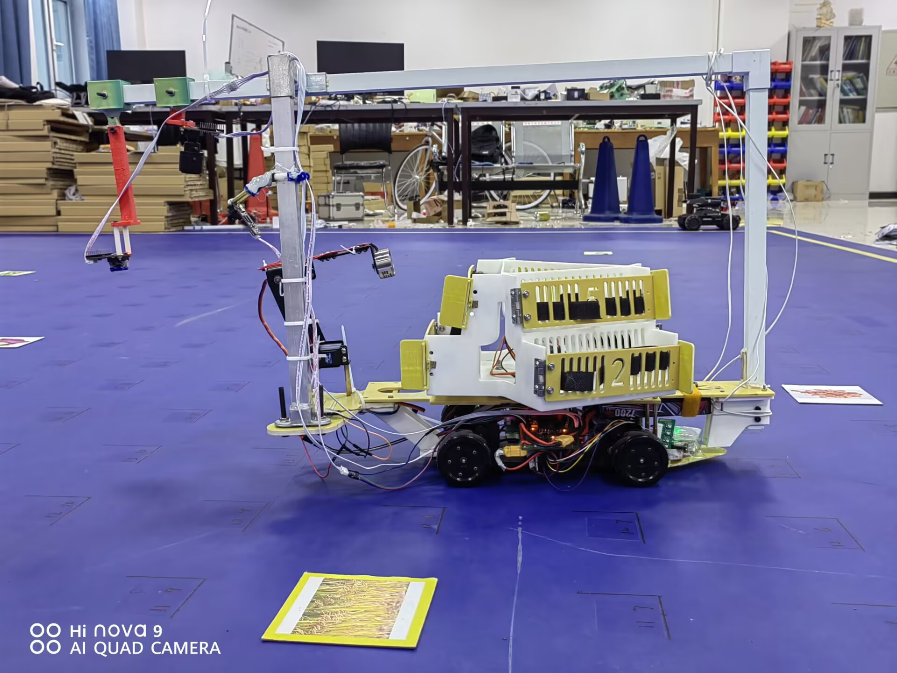
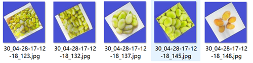
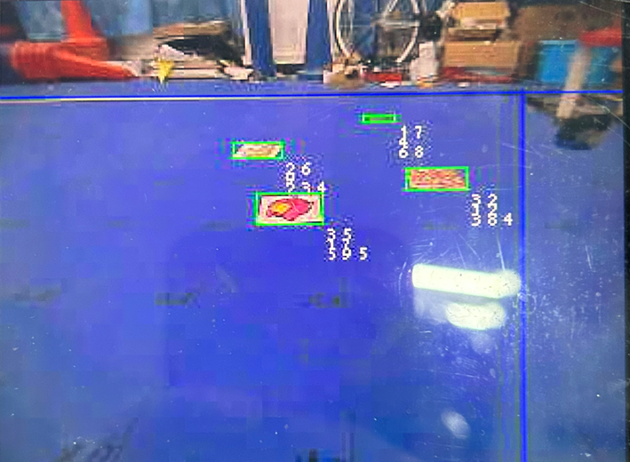
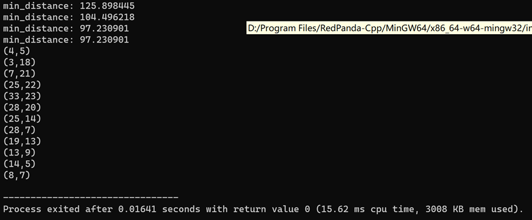

# 18ai-vision

第十八届全国大学生智能汽车竞赛 智能视觉组比赛 视觉任务报告和源代码



**遗憾才是人生常态**

- A4坐标纸（有框卡片）位置识别
- 15类图像分类任务
- 校准车的位置
- 无框卡片的搜寻
- 路径规划

​	基于以上任务，我选择使用3个openart mini来解决。其中art1摄像头负责A4坐标纸的识别以及图像分类任务；art2负责校准车的位置；art3负责无框卡片的搜寻。任务的不同，三个art的位置和镜头也有所不同。art1位置最低，使得A4纸点坐标识别特别精准；同时art1镜头装配偏振片，减少因为比赛场地出现强光对图像分类造成影响；art2位置最高同时使用广角镜头，目的是增大视野范围，即使车的定位比较偏也足矣找到卡片并进一步校准；art3使用130°大角度镜头，同时倾斜放置，增大视野范围，能够以最快速度遍历全图。下面将详细讲解各个任务的实现细节。

# A4坐标纸识别

- ​	A4纸的定位

​			当A4纸放置在art1下时，几乎整个视野内全是A4纸，但仍有部分干扰图像，为了方便后续图像处理和运算，先定位A4纸的位置。A4  纸为白色，因此在LAB色域根据L通道即可过滤出A4纸。并根据宽高过滤一些干扰元素增加鲁棒性。

- 点坐标识别区域定位

​			A4纸上的黑色矩形内部才是点坐标，黑色矩形的定位对后续图像处理很有必要。这里使用霍夫变换寻找矩形框。

- 点坐标识别

  ​	A4纸上的点分布在一个35x25的坐标上，为了将图像上的像素坐标映射到坐标系上，必须要获取相对原点和圆形坐标。

  ​	相对原点获取比较简单，在步骤2中已经获取了圆形点位识别区域的矩形，矩形左下角坐标就是相对原点。利用横纵坐标大小即可获得。随后获取圆形坐标，利用LAB色域即可过滤出圆形。最后进行映射过程，首先根据点坐标识别区域的像素长宽确定分辨率（像素长度与坐标的比例）

  ```python
  a4_corners = list(map_rect.corners())
  a4_corners = sorted(a4_corners, key = lambda k: k[0])
  A_and_C = sorted(a4_corners[:2], key = lambda k: k[1])
  B_and_D = sorted(a4_corners[2:], key = lambda k: k[1])
  img.draw_cross(A_and_C[1], color=(153, 20, 80))
  A,C = A_and_C[0],A_and_C[1]
  B,D = B_and_D[0],B_and_D[1]
  AB_dis = twopoints_dis(A, B)
  CD_dis = twopoints_dis(C, D)
  AC_dis = twopoints_dis(A, C)
  BD_dis = twopoints_dis(B, D)
  CD_line_paramlist = linear_equation(C, D)
  AC_line_paramlist = linear_equation(A, C)
  mean_AB_CD = (AB_dis + CD_dis)/2
  mean_AC_BD = (AC_dis + BD_dis)/2
  
  x_ratio = mean_AB_CD / (36*2)
  y_ratio = mean_AC_BD / (25*2)
  points_roi = (map_rect.x()+4,map_rect.y()+2,map_rect.w()-9,map_rect.h()-5)
  
  points_list = []
  point_blobs = img.find_blobs([points_threshold], roi = points_roi,x_stride=1, y_stride=1,invert = True)
  for point_blob in point_blobs:
      if point_blob.w() > 7 or point_blob.h() > 7:
          continue
      img.draw_rectangle(point_blob.rect(), color=(255, 0, 0))
      point = (point_blob.cxf(),point_blob.cyf())
      delta_x = dis_point_to_line(AC_line_paramlist, point)
      delta_y = dis_point_to_line(CD_line_paramlist, point)
  
      real_x = round((delta_x / x_ratio) + 1.0) // 2 # 几个半格
      real_y = round((delta_y / y_ratio) + 1.0) // 2 # 几个半格
      points_list.append((real_x,real_y))
  ```

  ​		其中twopoints_dis函数是求两点之间的距离，linear_equation是求得两点确定的直线，两条长宽取平均值增加准确度，最后利用像素长除上点坐标个数即可获得分辨率。

  最后利用圆形坐标位置到直线的距离获得的像素值乘以分辨率就是对应的点坐标。
# 图像分类

​	分类网络由mobilenetV2分类头+全连接分类器组成，起初使用kaggle平台免费白嫖GPU算力，后来由于数据集逐渐增大，上传到服务器的时间也比较长，所以最后借用了一台显卡较好的游戏本来训练模型；同时为了更好的监控训练曲线，果断放弃自行搭建训练脚本，使用NXP的eiq toolkit训练模型。下面是一些模型训练的经验：

- 数据集非常重要

​	一般情况下不用质疑模型的性能，如果训练的模型效果不尽人意，首先应该考虑的是数据集是否优质。数据集是否足够多、是否足够均衡、数据是否符合实际应用场景。基于以上，我做了一些图像增强策略，由于卡片摆在蓝色背景下（最开始车的运动策略并不是全向移动，所以摄像头采集的卡片不一定是正的，会存在一定旋转角度），所以可以对图片做一些旋转增强策略，同时对卡片做蓝色背景填充；训练过程中还使用了其他图像增强策略例如调整亮度、添加随机模糊、Random Cut、Hue等。



​	为了让训练集更加接近摄像头实际采集的图片，数据集大部分使用摄像头实拍采集，提高了模型的实际部署时的准确度；不定期对数据集进行清洗工作，剔除劣质数据集补充更加优质的数据。数据集的备置花费了很多时间，但这一步骤对于提高模型准确率至关重要。

- Learning_Rate、Batch_size等超参数设置

​	对于Learning_Rate的调整有许多策略，例如warmup、模拟退火等，目的就是让模型有更平缓的训练曲线，使得模型参数更新更加稳定。由于我使用的是基于imagenet迁移训练，主要训练后层的分类器，所以Learning_Rate并不需要考虑过多，设置为0.0001即可；随着数据集的不断扩增，Batch_size也应该调高，因为当数据集较大、Batch_size较小时，模型参数更新频繁，导致训练过程极不稳定。

- Epochs

​	模型并不是训练时间越长越好，过拟合会导致模型性能大幅度下降。所以在模型训练初期，不要急于测试模型部署的准确率，不要对初代模型有较高期待，更应该着重关注训练曲线，最为重要的就是验证集的损失值。当验证集的损失值在一个维持在一个较小的值且出现波动时，即可停止训练。此时模型有一些过拟合但也具有泛化能力。

- 模型的量化和部署

​	Float32的参数量化到int8过程中精度会有一定损失，但损失并不会太大。如果出现模型量化、部署后准确度特别低的时候就要考虑量化模型的使用方法是否错误。例如是否正确设置参数、是否正确对输入数据进行归一化等。我用测试脚本测试量化后模型准确率时，发现准确率几乎为0，最后检查发现并没有对输入数据正确归一化。利用openart推理tflite模型时并不需要考虑这些问题，库会自动根据模型完成输入数据的处理。

实际使用中为了进一步保证分类的准确度，我使用了多次识别加权的方法。

# 无框卡片搜寻

无框卡片随机出现在场地上，遍历全场显然是最稳定的方案，但速度不尽人意。对于无框的定位，逐飞提供了目标检测方案，但我认为目标检测并不合适，首先目标检yolo模型的训练比较花费时间尤其是数据集的标注；其次目标检测的效果并不会太好，大概率会出现误识别，在实际比赛中也得到了印证，确实会误识别黄线导致车运行不正常。为了避免误识别问题，同时还要保证摄像头看的更远，我将摄像头倾斜，利用LAB色域滤过卡片可能的位置，同时利用逆透视根据卡片特性对其进行过滤。实测车跑两次即可完成全图的卡片拾取。



```python
blobs = img.find_blobs(blue_thresholds,roi = set_roi,invert=True,merge=False)
for blob in blobs:
    area = blob.area()
    w = blob.w()
    h = blob.h()
    x = blob.x()
    y = blob.y()
    if area > 2500 or area < 20:
        continue
    if w < h:
        continue
    if w > 100:
        continue
    #if p > 4 or p < 2.5:
        #continue
    x2 = x + w
    y2 = y
    x3 = x
    y3 = y + h

    denom = M[6] * x + M[7] * y + 1
    x_transformed = (M[0] * x + M[1] * y + M[2]) / denom
    y_transformed = (M[3] * x + M[4] * y + M[5]) / denom

    denom = M[6] * x2 + M[7] * y2 + 1
    x2_transformed = (M[0] * x2 + M[1] * y2 + M[2]) / denom
    y2_transformed = (M[3] * x2 + M[4] * y2 + M[5]) / denom

    denom = M[6] * x3 + M[7] * y3 + 1
    x3_transformed = (M[0] * x3 + M[1] * y3 + M[2]) / denom
    y3_transformed = (M[3] * x3 + M[4] * y3 + M[5]) / denom
    #print(x2_transformed - x_transformed,y3_transformed-y_transformed)
    if (abs(abs(x2_transformed - x_transformed) - abs(y3_transformed-y_transformed)) > 30):
        #img.draw_rectangle(blob.rect(),color = (255,0,0))
        #img.draw_string(blob.x()+blob.w(),blob.y()+blob.h(),str("1"))
        continue
    elif(abs(x2_transformed - x_transformed) < 10):
        #img.draw_rectangle(blob.rect(),color = (255,0,0))
        #img.draw_string(blob.x()+blob.w(),blob.y()+blob.h(),str("2"))
        continue
    elif(abs(x2_transformed - x_transformed) > 20):
        #img.draw_rectangle(blob.rect(),color = (255,0,0))
        #img.draw_string(blob.x()+blob.w(),blob.y()+blob.h(),str("3"))
        continue
    elif(abs(y3_transformed - y_transformed) < 11):
        #img.draw_rectangle(blob.rect(),color = (255,0,0))
        #img.draw_string(blob.x()+blob.w(),blob.y()+blob.h(),str("3"))
        continue
    elif(abs(y3_transformed - y_transformed) > 19):
        #img.draw_rectangle(blob.rect(),color = (255,0,0))
        #img.draw_string(blob.x()+blob.w(),blob.y()+blob.h(),str("3"))
        continue
    if(y < 50):
        if(blob.pixels()/area < 0.65):
            #img.draw_rectangle(blob.rect(),color = (255,0,0))
            #img.draw_string(blob.x()+blob.w(),blob.y()+blob.h(),str("4"))
            continue
    else:
        if(blob.pixels()/area < 0.3):
            #img.draw_rectangle(blob.rect(),color = (255,0,0))
            #img.draw_string(blob.x()+blob.w(),blob.y()+blob.h(),str("4"))
            continue
    all_obj_list.append(((x_transformed + x2_transformed) // 2 - x_offsets,(y3_transformed + y_transformed) // 2  - y_offsets))
    show_obj_list.append((x,y,w,h))
if(len(show_obj_list) != 0):
    if(len(show_obj_list) == 1):
        nearest_obj_index = 0
    else:
        nearest_obj_index = max(range(len(show_obj_list)), key=lambda i: show_obj_list[i][2])
```

# 路径规划

使用遗传算法+opt-2结合完成TSP问题的求解，兼顾全局和局部搜索能力。部署在单片机上半秒即可完成路径规划。



解决基因冲突问题

```c
void intercross(int* individual_a, int* individual_b) {
	int r1 = rand() % point_counts;
	int r2 = rand() % point_counts;
	// 保证 r1 != r2
	while (r1 == r2) {
		r2 = rand() % point_counts;
	}
	// 保证r1 < r2 
	if (r1 > r2) {
		int temp = r1;
		r1 = r2;
		r2 = temp;
	}
	/*printf("r1=%d r2=%d", r1, r2);*/
	/*保存重组段*/
	int exchange_counts = r2 - r1 + 1;
	int exchange_a[MAX_POINT_COUNTS] = { 0 };
	int exchange_b[MAX_POINT_COUNTS] = { 0 };
	int _r1 = r1;
	for (int i = 0; i < exchange_counts; i++) {
		exchange_a[i] = individual_a[_r1];
		exchange_b[i] = individual_b[_r1];
		_r1++;
	}
	_r1 = r1;
	/*交换重组段*/
	for (int i = 0; i < exchange_counts; i++) {
		individual_a[_r1] = exchange_b[i];
		individual_b[_r1] = exchange_a[i];
		_r1++;
	}
	int conflict_index = 0;
	while (check(individual_a, r1, r2, &conflict_index)) {
		int conflict_index_in_b = get_gens_index(exchange_b, exchange_counts, individual_a[conflict_index]);
		individual_a[conflict_index] = exchange_a[conflict_index_in_b];
	}
	while (check(individual_b, r1, r2, &conflict_index)) {
		int conflict_index_in_a = get_gens_index(exchange_a, exchange_counts, individual_b[conflict_index]);
		individual_b[conflict_index] = exchange_b[conflict_index_in_a];
	}
}
```

opt-2实现

```c
void reverse(void)
{
	double pick1, pick2;
	double dis, reverse_dis;
	int n;
	int flag, pos1, pos2, temp;
	int reverse_arr[MAX_POINT_COUNTS];

	for (int i = 0; i < INDIVIDUAL_COUNTS; i++)
	{
		flag = 0; // 用于控制本次逆转是否有效
		while (flag == 0)
		{
			pick1 = ((double)rand()) / (RAND_MAX);
			pick2 = ((double)rand()) / (RAND_MAX);
			pos1 = (int)(pick1 * point_counts); // 选取进行逆转操作的位置
			pos2 = (int)(pick2 * point_counts);
			while (pos1 > point_counts - 1)
			{
				pick1 = ((double)rand()) / (RAND_MAX);
				pos1 = (int)(pick1 * point_counts);
			}
			while (pos2 > point_counts - 1)
			{
				pick2 = ((double)rand()) / (RAND_MAX);
				pos2 = (int)(pick2 * point_counts);
			}
			if (pos1 > pos2)
			{
				temp = pos1;
				pos1 = pos2;
				pos2 = temp; // 交换使得pos1 <= pos2
			}
			if (pos1 < pos2)
			{
				for (int j = 0; j < point_counts; j++)
					reverse_arr[j] = individual[i][j]; // 复制数组
				n = 0; // 逆转数目
				for (int j = pos1; j <= pos2; j++)
				{
					reverse_arr[j] = individual[i][pos2 - n]; // 逆转数组
					n++;
				}
				reverse_dis = get_individual_distance(reverse_arr); // 逆转之后的距离
				dis = get_individual_distance(individual[i]); // 原始距离
				if (reverse_dis < dis)
				{
					for (int j = 0; j < point_counts; j++)
						individual[i][j] = reverse_arr[j]; // 更新个体
				}
			}
			flag = 1;
		}

	}
}
```


  
